```python
from retinaface import RetinaFace
from deepface.DeepFace import VGGFace
from deepface.commons import functions
from deepface import DeepFace as df

from tensorflow.keras.layers import Convolution2D, Flatten, Activation, ZeroPadding2D, MaxPooling2D, Dropout
from tensorflow.keras.models import Model, Sequential
import tensorflow as tf
from tensorflow import keras
from sklearn import preprocessing

import numpy as np
import matplotlib.cm as cm
from IPython.display import Image, display
import cv2
import matplotlib.pyplot as plt

```

# 이미지 path를 정하고, retinaface를 실행


```python
img_path = "IZ.jpg"
```


```python
resp = RetinaFace.detect_faces(img_path)
```


```python
resp # 단체사진에서 각 인물들의 위치를 출력
```


    {'face_1': {'score': 0.9994434714317322,
      'facial_area': [2974, 789, 3162, 1032],
      'landmarks': {'right_eye': [3034.819, 909.3675],
       'left_eye': [3115.0078, 872.0769],
       'nose': [3103.018, 936.6774],
       'mouth_right': [3074.0964, 988.31903],
       'mouth_left': [3139.173, 959.4092]}},
     'face_2': {'score': 0.9993415474891663,
      'facial_area': [2587, 768, 2773, 998],
      'landmarks': {'right_eye': [2642.2173, 852.42175],
       'left_eye': [2728.7104, 865.27405],
       'nose': [2679.3513, 915.1166],
       'mouth_right': [2637.7595, 938.54816],
       'mouth_left': [2706.0066, 949.52]}},
     'face_3': {'score': 0.9991714954376221,
      'facial_area': [3182, 263, 3359, 501],
      'landmarks': {'right_eye': [3210.1309, 368.0151],
       'left_eye': [3283.3875, 358.48248],
       'nose': [3234.7554, 412.8554],
       'mouth_right': [3229.7422, 449.75018],
       'mouth_left': [3288.0393, 441.67142]}},
     'face_4': {'score': 0.9988583326339722,
      'facial_area': [381, 674, 563, 909],
      'landmarks': {'right_eye': [438.52243, 777.6814],
       'left_eye': [524.19916, 781.7608],
       'nose': [483.28513, 836.6095],
       'mouth_right': [447.62946, 863.58215],
       'mouth_left': [508.29376, 866.6494]}},
     'face_5': {'score': 0.9982894062995911,
      'facial_area': [2264, 287, 2439, 530],
      'landmarks': {'right_eye': [2297.104, 395.5557],
       'left_eye': [2374.9097, 393.8409],
       'nose': [2326.4358, 444.27875],
       'mouth_right': [2308.09, 481.1088],
       'mouth_left': [2366.3552, 478.65594]}},
     'face_6': {'score': 0.9982123374938965,
      'facial_area': [879, 217, 1049, 445],
      'landmarks': {'right_eye': [948.6644, 323.26434],
       'left_eye': [1019.66785, 308.6936],
       'nose': [1003.587, 357.52585],
       'mouth_right': [963.3464, 397.9618],
       'mouth_left': [1020.7113, 387.21664]}},
     'face_7': {'score': 0.9980803728103638,
      'facial_area': [1751, 278, 1912, 480],
      'landmarks': {'right_eye': [1780.0626, 364.62906],
       'left_eye': [1851.7572, 348.78177],
       'nose': [1816.3518, 402.4486],
       'mouth_right': [1806.0071, 438.56815],
       'mouth_left': [1861.7698, 425.3516]}},
     'face_8': {'score': 0.9980409741401672,
      'facial_area': [523, 131, 691, 361],
      'landmarks': {'right_eye': [587.19727, 224.36981],
       'left_eye': [659.68317, 237.05025],
       'nose': [624.3955, 275.51093],
       'mouth_right': [582.61237, 302.32333],
       'mouth_left': [638.6141, 312.77338]}},
     'face_9': {'score': 0.9975427389144897,
      'facial_area': [1891, 633, 2069, 870],
      'landmarks': {'right_eye': [1930.0822, 728.50867],
       'left_eye': [2010.108, 732.77527],
       'nose': [1960.8398, 775.981],
       'mouth_right': [1937.5571, 818.3544],
       'mouth_left': [1993.834, 820.876]}},
     'face_10': {'score': 0.9970320463180542,
      'facial_area': [1160, 693, 1332, 922],
      'landmarks': {'right_eye': [1194.514, 787.16064],
       'left_eye': [1273.5348, 791.8915],
       'nose': [1225.4668, 838.4351],
       'mouth_right': [1203.2244, 871.8271],
       'mouth_left': [1261.3331, 874.9867]}},
     'face_11': {'score': 0.9968012571334839,
      'facial_area': [2673, 236, 2841, 471],
      'landmarks': {'right_eye': [2704.1558, 333.87198],
       'left_eye': [2777.355, 333.48233],
       'nose': [2728.986, 376.56216],
       'mouth_right': [2711.1902, 417.85284],
       'mouth_left': [2764.9138, 417.0546]}},
     'face_12': {'score': 0.9938441514968872,
      'facial_area': [1256, 312, 1427, 540],
      'landmarks': {'right_eye': [1318.9247, 424.07318],
       'left_eye': [1390.7759, 404.80096],
       'nose': [1373.9927, 458.22433],
       'mouth_right': [1337.9253, 492.6829],
       'mouth_left': [1397.389, 478.15878]}}}


```python
frame = []
for i in range(1,len(resp)+1):
    frame.append(resp['face_{}'.format(i)]['facial_area'])
```


```python
len(frame)
frame
```


    [[2974, 789, 3162, 1032],
     [2587, 768, 2773, 998],
     [3182, 263, 3359, 501],
     [381, 674, 563, 909],
     [2264, 287, 2439, 530],
     [879, 217, 1049, 445],
     [1751, 278, 1912, 480],
     [523, 131, 691, 361],
     [1891, 633, 2069, 870],
     [1160, 693, 1332, 922],
     [2673, 236, 2841, 471],
     [1256, 312, 1427, 540]]


```python
faces = RetinaFace.extract_faces(img_path = img_path, align = True)
for face in faces:
    plt.imshow(face)
    plt.show()
```


    
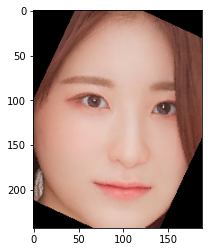
    


    
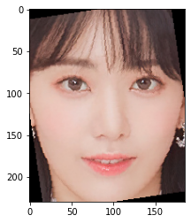
    


    
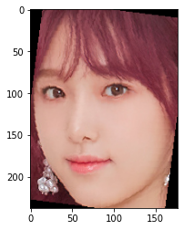
    


    
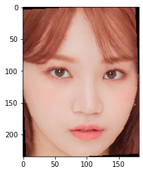
    


    
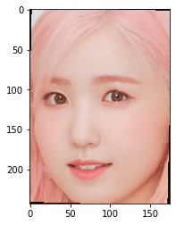
    


    
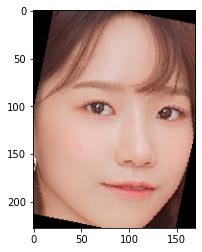
    


    
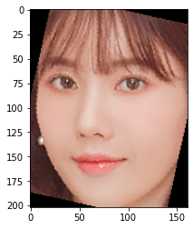
    


    
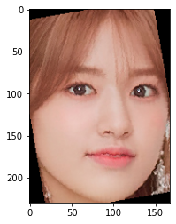
    


    
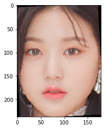
    


    
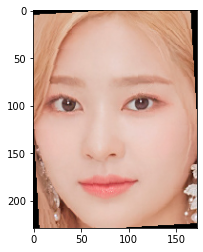
    


    
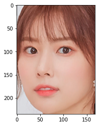
    


    
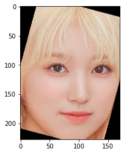
    


```python
imgcount = len(faces)
for i in range(imgcount):
    plt.imsave('./images/face_{}.jpg'.format(i+1),faces[i])
```

# deepface를 사용하여 얼굴을 분석


```python

for j in range(1,len(resp)+1):
    obj = df.analyze('./images/face_{}.jpg'.format(j), actions = ['emotion','age','gender'], enforce_detection = False)
    frame[j-1].append(obj['dominant_emotion'])
    frame[j-1].append(obj['emotion'][obj['dominant_emotion']])
    frame[j-1].append(obj['age'])
    frame[j-1].append(obj['gender'])
    
```

    Action: gender: 100%|████████████████████████████████████████████████████████████████████| 3/3 [00:00<00:00,  3.16it/s]
    Action: gender: 100%|████████████████████████████████████████████████████████████████████| 3/3 [00:00<00:00, 15.65it/s]
    Action: gender: 100%|████████████████████████████████████████████████████████████████████| 3/3 [00:00<00:00, 16.00it/s]
    Action: gender: 100%|████████████████████████████████████████████████████████████████████| 3/3 [00:00<00:00, 16.79it/s]
    Action: gender: 100%|████████████████████████████████████████████████████████████████████| 3/3 [00:00<00:00, 16.98it/s]
    Action: gender: 100%|████████████████████████████████████████████████████████████████████| 3/3 [00:00<00:00, 16.74it/s]
    Action: gender: 100%|████████████████████████████████████████████████████████████████████| 3/3 [00:00<00:00, 16.78it/s]
    Action: gender: 100%|████████████████████████████████████████████████████████████████████| 3/3 [00:00<00:00, 16.84it/s]
    Action: gender: 100%|████████████████████████████████████████████████████████████████████| 3/3 [00:00<00:00, 16.32it/s]
    Action: gender: 100%|████████████████████████████████████████████████████████████████████| 3/3 [00:00<00:00, 16.97it/s]
    Action: gender: 100%|████████████████████████████████████████████████████████████████████| 3/3 [00:00<00:00, 16.57it/s]
    Action: gender: 100%|████████████████████████████████████████████████████████████████████| 3/3 [00:00<00:00, 16.86it/s]
    


```python
len(frame)
```


    12


```python
for i in range(1,len(resp)+1):
    frame[i-1][5] = round(frame[i-1][5],2)
    frame[i-1].append(frame[i-1][4])
    frame[i-1][4] = frame[i-1][4]+' '+str(frame[i-1][5])
```


```python
frame
```


    [[2974, 789, 3162, 1032, 'happy 97.39', 97.39, 28, 'Woman', 'happy'],
     [2587, 768, 2773, 998, 'neutral 99.77', 99.77, 31, 'Woman', 'neutral'],
     [3182, 263, 3359, 501, 'neutral 80.72', 80.72, 28, 'Woman', 'neutral'],
     [381, 674, 563, 909, 'neutral 98.98', 98.98, 27, 'Woman', 'neutral'],
     [2264, 287, 2439, 530, 'neutral 63.08', 63.08, 28, 'Woman', 'neutral'],
     [879, 217, 1049, 445, 'happy 89.02', 89.02, 29, 'Woman', 'happy'],
     [1751, 278, 1912, 480, 'neutral 98.96', 98.96, 29, 'Woman', 'neutral'],
     [523, 131, 691, 361, 'neutral 97.83', 97.83, 30, 'Woman', 'neutral'],
     [1891, 633, 2069, 870, 'fear 93.49', 93.49, 26, 'Woman', 'fear'],
     [1160, 693, 1332, 922, 'neutral 99.77', 99.77, 30, 'Woman', 'neutral'],
     [2673, 236, 2841, 471, 'neutral 95.87', 95.87, 30, 'Woman', 'neutral'],
     [1256, 312, 1427, 540, 'happy 76.48', 76.48, 28, 'Woman', 'happy']]


```python
import cv2
img = cv2.imread(img_path)
```


```python
frame
```


    [[2974, 789, 3162, 1032, 'happy 97.39', 97.39, 28, 'Woman', 'happy'],
     [2587, 768, 2773, 998, 'neutral 99.77', 99.77, 31, 'Woman', 'neutral'],
     [3182, 263, 3359, 501, 'neutral 80.72', 80.72, 28, 'Woman', 'neutral'],
     [381, 674, 563, 909, 'neutral 98.98', 98.98, 27, 'Woman', 'neutral'],
     [2264, 287, 2439, 530, 'neutral 63.08', 63.08, 28, 'Woman', 'neutral'],
     [879, 217, 1049, 445, 'happy 89.02', 89.02, 29, 'Woman', 'happy'],
     [1751, 278, 1912, 480, 'neutral 98.96', 98.96, 29, 'Woman', 'neutral'],
     [523, 131, 691, 361, 'neutral 97.83', 97.83, 30, 'Woman', 'neutral'],
     [1891, 633, 2069, 870, 'fear 93.49', 93.49, 26, 'Woman', 'fear'],
     [1160, 693, 1332, 922, 'neutral 99.77', 99.77, 30, 'Woman', 'neutral'],
     [2673, 236, 2841, 471, 'neutral 95.87', 95.87, 30, 'Woman', 'neutral'],
     [1256, 312, 1427, 540, 'happy 76.48', 76.48, 28, 'Woman', 'happy']]


```python
people = [0,0,0]
mcnt = 0
wcnt = 0
for i in range(len(resp)):
    if frame[i][7] == "Man":
        mcnt += 1
    else:
        wcnt += 1
if not wcnt==0:
    people[0] = mcnt/(wcnt+mcnt)
else:
    people[0] = 100
    
ages = 0
for i in range(len(resp)):
    ages += frame[i][6]
people[1] = ages/len(resp)

'angry', 'disgust', 'fear', 'happy', 'sad', 'surprise', 'neutral'

an = 0
dis = 0
fe = 0
ha = 0
sad = 0
sur = 0
ne = 0

for i in range(len(resp)):
    if frame[i][8] == 'angry':
        an += 1
    elif frame[i][8] == 'disgust':
        dis += 1
    elif frame[i][8] == 'fear':
        fe += 1
    elif frame[i][8] == 'happy':
        ha += 1
    elif frame[i][8] == 'sad':
        sad += 1
    elif frame[i][8] == 'surprise':
        sur += 1
    else:
        ne += 1
pframe = [[an,'angry'],[dis,"disgust"],[fe,"fear"],[ha,"happy"],[sad,"sad"],[sur,"surprise"],[ne,"neutral"]]
people[2] = max(pframe)
```


```python
people
```


    [0.0, 28.666666666666668, [8, 'neutral']]


```python
people[1] = round(people[1],2)
people[0] = round(people[0],2)
```


```python
img = cv2.imread(img_path)
```

# opencv를 활용하여 분석했던 결과들을 이미지에 합성


```python
img = cv2.imread(img_path)
font = cv2.FONT_HERSHEY_TRIPLEX
for i in range(len(resp)):
    cv2.line(img, (frame[i][0],frame[i][1]-60), (frame[i][0]+200,frame[i][1]-60), (255, 255, 255), 100)

for i in range(len(resp)):
    cv2.rectangle(img,(frame[i][0],frame[i][1]),(frame[i][2],frame[i][3]),(0,255,0),3)
#     cv2.line(img, (frame[i][0],frame[i][1]-60), (frame[i][0]+200,frame[i][1]-60), (255, 255, 255), 100)
    cv2.putText(img, frame[i][7], (frame[i][0]-20,frame[i][1]-10), font, 1, (0,0,200), 2)
    cv2.putText(img, frame[i][4], (frame[i][0]-20,frame[i][1]-40), font, 1, (0,0,200), 2)
    cv2.putText(img, str(frame[i][6]), (frame[i][0]-20,frame[i][1]-65), font, 1, (0,0,200), 2)
    cv2.putText(img, "gender ratio: {}".format(people[0]),(10,img.shape[0]-50),font,3,(0,0,200),5)
    cv2.putText(img, "average age: {}".format(people[1]),(10,img.shape[0]-150),font,3,(0,0,200),5)
    cv2.putText(img, "mood: {}".format(people[2][1]),(10,img.shape[0]-250),font,3,(0,0,200),5)
    
    

dst = cv2.resize(img, dsize=(int(img.shape[1]/2.3), int(img.shape[0]/2.3)), interpolation=cv2.INTER_AREA)
cv2.imshow('img',dst)
cv2.waitKey()
cv2.destroyAllWindows()    
```

# 판단근거 시각화(age)


```python
iz = cv2.imread("IZ.jpg")
iz = functions.preprocess_face(iz,target_size = (226,226),grayscale = False,enforce_detection = False)
```

# vggface 모델을 베이스로 하는 age 판단 모델 선언


```python
model = Sequential()
model.add(ZeroPadding2D((1,1),input_shape=(224,224, 3)))
model.add(Convolution2D(64, (3, 3), activation='relu'))
model.add(ZeroPadding2D((1,1)))
model.add(Convolution2D(64, (3, 3), activation='relu'))
model.add(MaxPooling2D((2,2), strides=(2,2)))

model.add(ZeroPadding2D((1,1)))
model.add(Convolution2D(128, (3, 3), activation='relu'))
model.add(ZeroPadding2D((1,1)))
model.add(Convolution2D(128, (3, 3), activation='relu'))
model.add(MaxPooling2D((2,2), strides=(2,2)))

model.add(ZeroPadding2D((1,1)))
model.add(Convolution2D(256, (3, 3), activation='relu'))
model.add(ZeroPadding2D((1,1)))
model.add(Convolution2D(256, (3, 3), activation='relu'))
model.add(ZeroPadding2D((1,1)))
model.add(Convolution2D(256, (3, 3), activation='relu'))
model.add(MaxPooling2D((2,2), strides=(2,2)))

model.add(ZeroPadding2D((1,1)))
model.add(Convolution2D(512, (3, 3), activation='relu'))
model.add(ZeroPadding2D((1,1)))
model.add(Convolution2D(512, (3, 3), activation='relu'))
model.add(ZeroPadding2D((1,1)))
model.add(Convolution2D(512, (3, 3), activation='relu'))
model.add(MaxPooling2D((2,2), strides=(2,2)))

model.add(ZeroPadding2D((1,1)))
model.add(Convolution2D(512, (3, 3), activation='relu'))
model.add(ZeroPadding2D((1,1)))
model.add(Convolution2D(512, (3, 3), activation='relu'))
model.add(ZeroPadding2D((1,1)))
model.add(Convolution2D(512, (3, 3), activation='relu',name = 'last'))
model.add(MaxPooling2D((2,2), strides=(2,2)))

model.add(Convolution2D(4096, (7, 7), activation='relu'))
model.add(Dropout(0.5))
model.add(Convolution2D(4096, (1, 1), activation='relu'))
model.add(Dropout(0.5))
model.add(Convolution2D(2622, (1, 1)))
model.add(Flatten())
model.add(Activation('softmax'))
```


```python
#--------------------------

classes = 101
base_model_output = Sequential()
base_model_output = Convolution2D(classes, (1, 1), name='predictions')(model.layers[-4].output)
base_model_output = Flatten()(base_model_output)
base_model_output = Activation('softmax')(base_model_output)

#--------------------------

age_model = Model(inputs=model.input, outputs=base_model_output)
```


```python
model.summary()
```

    Model: "sequential_5"
    _________________________________________________________________
    Layer (type)                 Output Shape              Param #   
    =================================================================
    zero_padding2d_61 (ZeroPaddi (None, 226, 226, 3)       0         
    _________________________________________________________________
    conv2d_37 (Conv2D)           (None, 224, 224, 64)      1792      
    _________________________________________________________________
    zero_padding2d_62 (ZeroPaddi (None, 226, 226, 64)      0         
    _________________________________________________________________
    conv2d_38 (Conv2D)           (None, 224, 224, 64)      36928     
    _________________________________________________________________
    max_pooling2d_11 (MaxPooling (None, 112, 112, 64)      0         
    _________________________________________________________________
    zero_padding2d_63 (ZeroPaddi (None, 114, 114, 64)      0         
    _________________________________________________________________
    conv2d_39 (Conv2D)           (None, 112, 112, 128)     73856     
    _________________________________________________________________
    zero_padding2d_64 (ZeroPaddi (None, 114, 114, 128)     0         
    _________________________________________________________________
    conv2d_40 (Conv2D)           (None, 112, 112, 128)     147584    
    _________________________________________________________________
    max_pooling2d_12 (MaxPooling (None, 56, 56, 128)       0         
    _________________________________________________________________
    zero_padding2d_65 (ZeroPaddi (None, 58, 58, 128)       0         
    _________________________________________________________________
    conv2d_41 (Conv2D)           (None, 56, 56, 256)       295168    
    _________________________________________________________________
    zero_padding2d_66 (ZeroPaddi (None, 58, 58, 256)       0         
    _________________________________________________________________
    conv2d_42 (Conv2D)           (None, 56, 56, 256)       590080    
    _________________________________________________________________
    zero_padding2d_67 (ZeroPaddi (None, 58, 58, 256)       0         
    _________________________________________________________________
    conv2d_43 (Conv2D)           (None, 56, 56, 256)       590080    
    _________________________________________________________________
    max_pooling2d_13 (MaxPooling (None, 28, 28, 256)       0         
    _________________________________________________________________
    zero_padding2d_68 (ZeroPaddi (None, 30, 30, 256)       0         
    _________________________________________________________________
    conv2d_44 (Conv2D)           (None, 28, 28, 512)       1180160   
    _________________________________________________________________
    zero_padding2d_69 (ZeroPaddi (None, 30, 30, 512)       0         
    _________________________________________________________________
    conv2d_45 (Conv2D)           (None, 28, 28, 512)       2359808   
    _________________________________________________________________
    zero_padding2d_70 (ZeroPaddi (None, 30, 30, 512)       0         
    _________________________________________________________________
    conv2d_46 (Conv2D)           (None, 28, 28, 512)       2359808   
    _________________________________________________________________
    max_pooling2d_14 (MaxPooling (None, 14, 14, 512)       0         
    _________________________________________________________________
    zero_padding2d_71 (ZeroPaddi (None, 16, 16, 512)       0         
    _________________________________________________________________
    conv2d_47 (Conv2D)           (None, 14, 14, 512)       2359808   
    _________________________________________________________________
    zero_padding2d_72 (ZeroPaddi (None, 16, 16, 512)       0         
    _________________________________________________________________
    conv2d_48 (Conv2D)           (None, 14, 14, 512)       2359808   
    _________________________________________________________________
    zero_padding2d_73 (ZeroPaddi (None, 16, 16, 512)       0         
    _________________________________________________________________
    last (Conv2D)                (None, 14, 14, 512)       2359808   
    _________________________________________________________________
    max_pooling2d_15 (MaxPooling (None, 7, 7, 512)         0         
    _________________________________________________________________
    conv2d_49 (Conv2D)           (None, 1, 1, 4096)        102764544 
    _________________________________________________________________
    dropout_6 (Dropout)          (None, 1, 1, 4096)        0         
    _________________________________________________________________
    conv2d_50 (Conv2D)           (None, 1, 1, 4096)        16781312  
    _________________________________________________________________
    dropout_7 (Dropout)          (None, 1, 1, 4096)        0         
    _________________________________________________________________
    conv2d_51 (Conv2D)           (None, 1, 1, 2622)        10742334  
    _________________________________________________________________
    flatten_5 (Flatten)          (None, 2622)              0         
    _________________________________________________________________
    activation_4 (Activation)    (None, 2622)              0         
    =================================================================
    Total params: 145,002,878
    Trainable params: 145,002,878
    Non-trainable params: 0
    _________________________________________________________________
    

# gradcam 사용


```python
def make_gradcam_heatmap(img_array, model, last_conv_layer_name, pred_index=None):
    # First, we create a model that maps the input image to the activations
    # of the last conv layer as well as the output predictions
    grad_model = tf.keras.models.Model(
        [model.inputs], [model.get_layer(last_conv_layer_name).output, model.output]
    )

    # Then, we compute the gradient of the top predicted class for our input image
    # with respect to the activations of the last conv layer
    with tf.GradientTape() as tape:
        last_conv_layer_output, preds = grad_model(img_array)
        if pred_index is None:
            pred_index = tf.argmax(preds[0])
        class_channel = preds[:, pred_index]

    # This is the gradient of the output neuron (top predicted or chosen)
    # with regard to the output feature map of the last conv layer
    grads = tape.gradient(class_channel, last_conv_layer_output)

    # This is a vector where each entry is the mean intensity of the gradient
    # over a specific feature map channel
    pooled_grads = tf.reduce_mean(grads, axis=(0, 1, 2))

    # We multiply each channel in the feature map array
    # by "how important this channel is" with regard to the top predicted class
    # then sum all the channels to obtain the heatmap class activation
    last_conv_layer_output = last_conv_layer_output[0]
    heatmap = last_conv_layer_output @ pooled_grads[..., tf.newaxis]
    heatmap = tf.squeeze(heatmap)

    # For visualization purpose, we will also normalize the heatmap between 0 & 1
    heatmap = tf.maximum(heatmap, 0) / tf.math.reduce_max(heatmap)
    return heatmap.numpy()

def save_and_display_gradcam(img_path, heatmap, cam_path="cam.jpg", alpha=0.4):
    # Load the original image
    img = keras.preprocessing.image.load_img(img_path)
    img = keras.preprocessing.image.img_to_array(img)

    # Rescale heatmap to a range 0-255
    heatmap = np.uint8(255 * heatmap)

    # Use jet colormap to colorize heatmap
    jet = cm.get_cmap("jet")

    # Use RGB values of the colormap
    jet_colors = jet(np.arange(256))[:, :3]
    jet_heatmap = jet_colors[heatmap]

    # Create an image with RGB colorized heatmap
    jet_heatmap = keras.preprocessing.image.array_to_img(jet_heatmap)
    jet_heatmap = jet_heatmap.resize((img.shape[1], img.shape[0]))
    jet_heatmap = keras.preprocessing.image.img_to_array(jet_heatmap)

    # Superimpose the heatmap on original image
    superimposed_img = jet_heatmap * alpha + img
    superimposed_img = keras.preprocessing.image.array_to_img(superimposed_img)

    # Save the superimposed image
    superimposed_img.save(cam_path)

    # Display Grad CAM
    display(Image(cam_path))

```


```python
heatmap = make_gradcam_heatmap(iz,model,'last')
plt.matshow(heatmap)
plt.show()
```


    
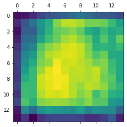
    


```python
#minmax scaling
temp = heatmap
min_max_scaler = preprocessing.MinMaxScaler()
temp = min_max_scaler.fit_transform(temp)
```


```python
plt.matshow(temp)
plt.show()
```


    
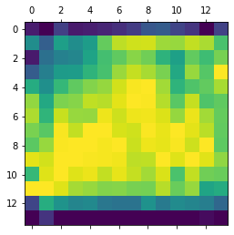
    


```python
save_and_display_gradcam('./images/face_8.jpg', heatmap)
```


    
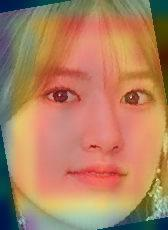
    


```python
save_and_display_gradcam('./images/face_8.jpg', temp)
```


    
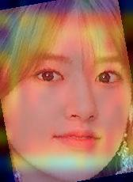
    


```python

```
